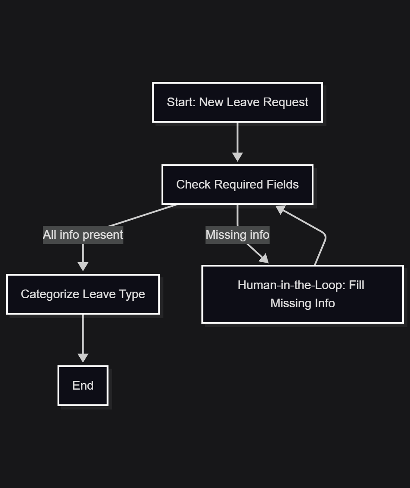

# Leave Request Agent
LangGraph Agent to validate and categorize employee leave requests, with human-in-the-loop support for missing details using UiPath Action Center supported by UiPath SDK

---

## Agent Workflow (LangGraph)


## Prerequisites

- Python 3.10+ installed
- Access to UiPath Cloud and Orchestrator
- Git installed (optional, see below)

## Installation and Setup

1.  **Download the repository:**

    You have two options:

    * **Option A: With Git**
        ```bash
        git clone https://github.com/rajneeshk94/LeaveRequestAgent.git
        ```
    * **Option B: Without Git (Download ZIP)**
        1.  Click the green `<> Code` button.
        2.  Select `Download ZIP`.
        3.  Unzip the downloaded file (e.g., `LeaveRequestAgent-main.zip`) to your desired location.

2.  **Navigate to the project directory:**
    ```bash
    # If you used git clone:
    cd LeaveRequestAgent

    # If you downloaded the ZIP, the folder name might be different:
    cd LeaveRequestAgent-main
    ```

3.  **Create a virtual environment:**
    ```bash
    python -m venv venv
    ```

4.  **Activate the virtual environment:**
    -   On Windows:
        ```bash
        .\venv\Scripts\activate
        ```
    -   On macOS/Linux:
        ```bash
        source venv/bin/activate
        ```

5.  **Install dependencies:**
    ```bash
    pip install -r requirements.txt
    ```

6.  **Configure user details:**
    -   Open the `pyproject.toml` file.
    -   Change the `name` and `email` values to your name and email.

7.  **Authenticate with UiPath:**
    ```bash
    uipath auth
    ```

8.  **Package the project:**
    ```bash
    uipath pack
    ```

9.  **Publish the project:**
    ```bash
    uipath publish
    ```
    -   When prompted, type and select `0` for the default tenant.

---

## Usage

1.  **Open UiPath Cloud** and navigate to **Orchestrator**.
2.  Go to the **Shared folder**, then to **Processes**, and add the process named `leave_request_agent`.
3.  Go to **UiPath Apps**.
4.  Select **Create new app**, then **Import from file**.
5.  Select the `LeaveRequestApp.uiapp` file from the repository and **Publish** the app.
6.  Go back to the **Shared folder** in Orchestrator and navigate to **Apps**.
7.  **Deploy** the `LeaveRequestApp`.
8.  Navigate to **Processes** and start the `leave_request_agent` job.
9.  Fill in the `leave_request` argument and click on **Start**.
10. **Open the Job Logs** to see the traces and follow the execution of the agent.